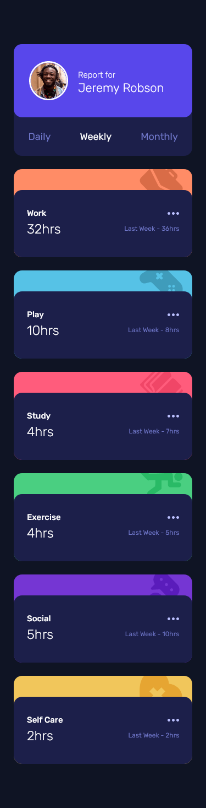
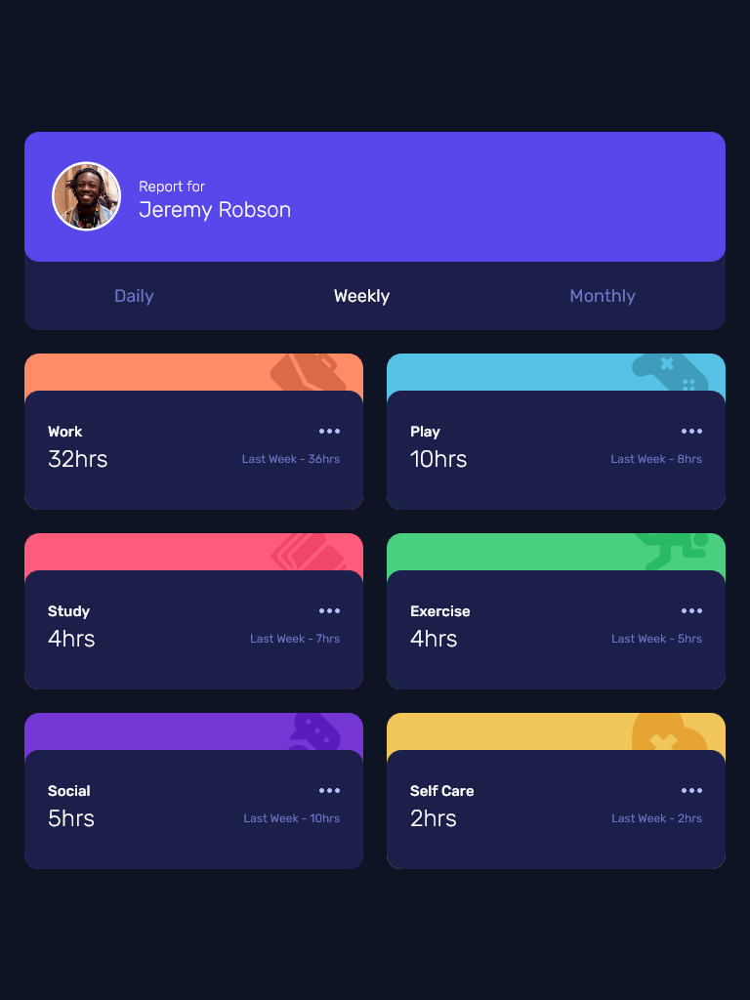
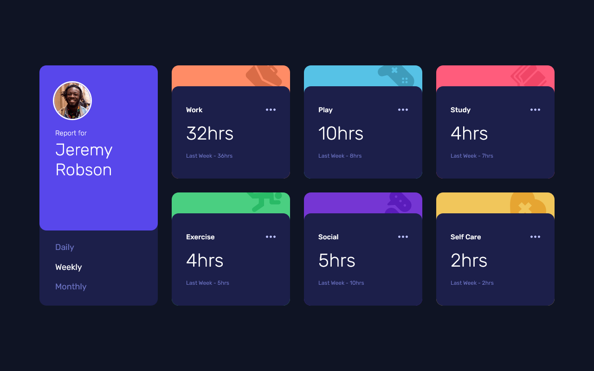

# Frontend Mentor - Time tracking dashboard solution

This is a solution to the [Time tracking dashboard challenge on Frontend Mentor](https://www.frontendmentor.io/challenges/time-tracking-dashboard-UIQ7167Jw). Frontend Mentor challenges help you improve your coding skills by building realistic projects. 

## Table of contents

- [Overview](#overview)
  - [The challenge](#the-challenge)
  - [Screenshot](#screenshot)
- [My process](#my-process)
  - [Built with](#built-with)
  - [What I learned](#what-i-learned)
  - [Continued development](#continued-development)
  - [Useful resources](#useful-resources)
- [Author](#author)

## Overview

### The challenge

Users should be able to:

- View the optimal layout for the site depending on their device's screen size
- See hover states for all interactive elements on the page
- Switch between viewing Daily, Weekly, and Monthly stats

### Screenshot

These are some screenshots of my result:

## My process

### Built with

- Semantic HTML5 markup
- CSS Grid
- Flexbox
- Javascript
- Json
- Mobile-first workflow
- BEM syntax
- SCSS

### What I learned

1. How to load Json files and use data stored inside in Javascript
2. How to code a CSS grid layout
3. How to handle deeply nested elements using BEM naming convention
4. How to create functions using SCSS

### Continued development

In future projects, I want to continue focusing on:
1. making clear and readable code;
2. creating good layouts;
3. learning javascript.

### Useful resources

[Working with JSON](https://developer.mozilla.org/en-US/docs/Learn/JavaScript/Objects/JSON) - MDN article giving bases to work with data stored in JSON using Javascript.
[CSS Grid Garden](https://cssgridgarden.com/#it) - I suggest you play this game if you don't know how to use css grid. You'll learn the basics in no time!  
[A complete Guide to Grid](https://css-tricks.com/snippets/css/complete-guide-grid/) - In this article you find a recap of all the informations about CSS Grid Layout.
[BEM Grandchildren: How To Handle Deeply Nested Elements](https://scalablecss.com/bem-nesting-grandchild-elements/) - Here I found some useful tips that helped me overcome some issues concerning naming classes.

## Author

- Github - [elisa-charrier](https://github.com/elisa-charrier)
- Frontend Mentor - [@elisa-charrier](https://www.frontendmentor.io/profile/elisa-charrier)